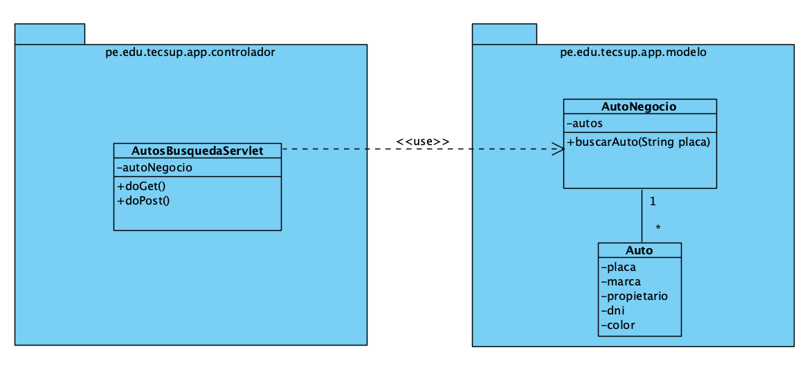

## Ejercicio

Se tiene 4 autos

- Placa: ABC-123 | Marca: Toyota | Propietario: Juan Pérez | DNI: 12345678 | Color: Rojo
- Placa: XYZ-789 | Marca: Honda | Propietario: María López | DNI: 87654321 | Color: Azul
- Placa: LMN-456 | Marca: Ford | Propietario: Carlos Ramos | DNI: 45678912 | Color: Negro
- Placa: QWE-321 | Marca: Kia | Propietario: Ana Torres | DNI: 78912345 | Color: Blanco

Se debe crear un formulario para ingresar la placa de un auto y se debe ver el nombre del propietario y marca del auto

